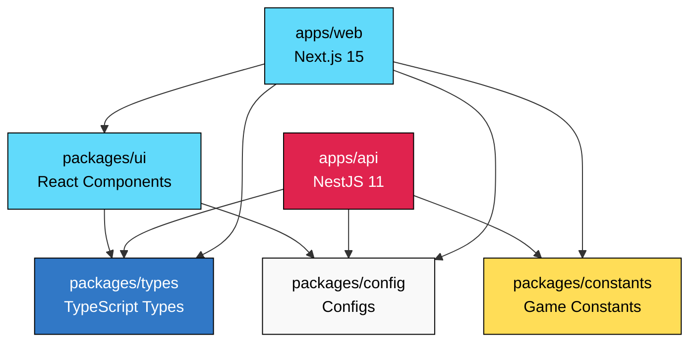
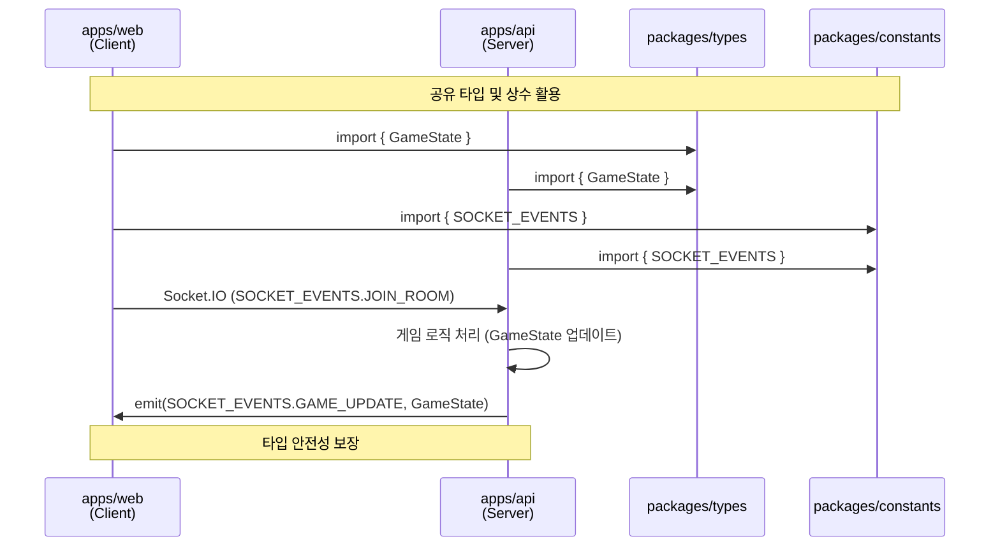
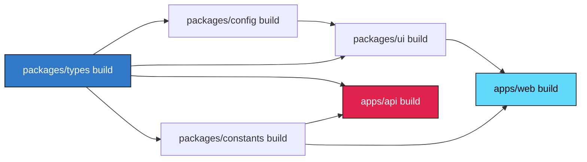

<!-- @DOC:SETUP-001 | SPEC: .moai/specs/SPEC-SETUP-001/spec.md -->

# Turborepo 모노레포 아키텍처

**버전**: 0.1.0
**최종 업데이트**: 2025-10-11
**SPEC 참조**: `.moai/specs/SPEC-SETUP-001/spec.md`

---

## 개요

Liar Game 프로젝트는 Turborepo 기반 모노레포 구조로 설계되었습니다. 프론트엔드(Next.js 15)와 백엔드(NestJS 11)가 공유 타입 및 상수를 효율적으로 활용하여, 타입 안전성을 보장하면서도 독립적인 개발과 배포가 가능합니다.

### 핵심 목표

1. **타입 안전성**: 프론트-백엔드 간 타입 불일치 제로
2. **빌드 최적화**: 증분 빌드 및 병렬 빌드로 개발 속도 향상
3. **독립적 배포**: 각 앱을 독립적으로 배포 가능
4. **코드 재사용**: 공유 라이브러리로 중복 코드 제거

### 기술적 혜택

- **개발 속도**: 변경된 패키지만 재빌드 (10초 이내)
- **CI/CD 효율**: 병렬 빌드로 전체 빌드 시간 단축 (3분 이내)
- **타입 동기화**: `packages/types` 수정 시 의존 앱 자동 재빌드
- **캐싱**: Turborepo 캐싱으로 중복 작업 제거

---

## 아키텍처 다이어그램

### 의존성 그래프



### 데이터 흐름 (실시간 게임)



---

## 패키지 구조

### apps/web (프론트엔드)

**역할**: 사용자 인터페이스 및 클라이언트 로직

```
apps/web/
├── src/
│   ├── app/                # Next.js App Router
│   │   ├── layout.tsx     # 루트 레이아웃
│   │   ├── page.tsx       # 홈페이지
│   │   └── game/          # 게임 페이지
│   ├── components/        # React 컴포넌트
│   ├── hooks/             # 커스텀 훅 (useSocket, useGameState)
│   └── lib/               # 유틸리티 함수
├── public/                # 정적 파일
├── next.config.js         # Next.js 설정
├── package.json
└── tsconfig.json
```

**주요 의존성**:
- `@liar-game/types`: 게임 상태, 플레이어 타입
- `@liar-game/ui`: 공유 UI 컴포넌트
- `@liar-game/constants`: Socket.IO 이벤트, 게임 상수

**빌드 산출물**: `.next/` (Next.js standalone 빌드)

### apps/api (백엔드)

**역할**: REST API 및 WebSocket Gateway

```
apps/api/
├── src/
│   ├── main.ts            # NestJS + Fastify 엔트리포인트
│   ├── app.module.ts      # 루트 모듈
│   ├── game/              # 게임 로직 모듈
│   │   ├── game.service.ts
│   │   ├── game.controller.ts
│   │   └── game.module.ts
│   ├── gateway/           # WebSocket Gateway
│   │   ├── game.gateway.ts
│   │   └── game.gateway.spec.ts
│   ├── user/              # 사용자 관리
│   └── match/             # 매칭 시스템
├── test/                  # e2e 테스트
├── nest-cli.json          # NestJS CLI 설정
├── package.json
└── tsconfig.json
```

**주요 의존성**:
- `@liar-game/types`: 타입 정의 (GameState, Player 등)
- `@liar-game/constants`: Socket.IO 이벤트, 게임 규칙

**빌드 산출물**: `dist/` (Fastify 서버 번들)

### packages/types (공유 타입)

**역할**: 프론트-백엔드 간 타입 Single Source of Truth

```
packages/types/
├── src/
│   ├── index.ts           # 타입 재내보내기
│   ├── game.ts            # GameState, Player, PlayerRole
│   ├── socket.ts          # Socket.IO 이벤트 타입
│   └── api.ts             # REST API 요청/응답 타입
├── package.json
└── tsconfig.json
```

**주요 타입**:
```typescript
// game.ts
export enum PlayerRole {
  CITIZEN = 'CITIZEN',
  LIAR = 'LIAR'
}

export interface Player {
  id: string;
  username: string;
  role: PlayerRole;
  isReady: boolean;
  votedFor: string | null;
}

export interface GameState {
  roomId: string;
  round: number;
  phase: 'WAITING' | 'DISCUSSION' | 'VOTING' | 'RESULT';
  keyword: string;
  players: Player[];
  timeRemaining: number;
}
```

### packages/config (공유 설정)

**역할**: ESLint, TSConfig, Prettier 통합 설정

```
packages/config/
├── eslint/
│   ├── base.js            # 공통 ESLint 규칙
│   ├── nextjs.js          # Next.js 전용 규칙
│   └── nestjs.js          # NestJS 전용 규칙
├── typescript/
│   ├── base.json          # 공통 TSConfig
│   ├── nextjs.json        # Next.js 전용 설정
│   └── nestjs.json        # NestJS 전용 설정
└── package.json
```

**사용 예시**:
```json
// apps/web/tsconfig.json
{
  "extends": "@liar-game/config/typescript/nextjs.json",
  "include": ["src/**/*"]
}
```

### packages/ui (공유 컴포넌트)

**역할**: 재사용 가능한 React 컴포넌트

```
packages/ui/
├── src/
│   ├── index.ts           # 컴포넌트 재내보내기
│   ├── Button.tsx         # 버튼 컴포넌트
│   ├── Card.tsx           # 카드 컴포넌트
│   └── Modal.tsx          # 모달 컴포넌트
├── package.json
└── tsconfig.json
```

**설계 원칙**:
- 순수 함수형 컴포넌트
- 타입 안전성 (TypeScript strict mode)
- 스타일 독립성 (CSS Modules)

### packages/constants (게임 상수)

**역할**: 게임 규칙 및 Socket.IO 이벤트 정의

```
packages/constants/
├── src/
│   ├── index.ts           # 상수 재내보내기
│   ├── game-rules.ts      # 게임 규칙 (플레이어 수, 시간 등)
│   └── socket-events.ts   # Socket.IO 이벤트 정의
├── package.json
└── tsconfig.json
```

**주요 상수**:
```typescript
// game-rules.ts
export const GAME_CONFIG = {
  MIN_PLAYERS: 6,
  MAX_PLAYERS: 6,
  DISCUSSION_TIME: 300, // 5분
  VOTING_TIME: 60,      // 1분
};

// socket-events.ts
export const SOCKET_EVENTS = {
  JOIN_ROOM: 'joinRoom',
  LEAVE_ROOM: 'leaveRoom',
  GAME_START: 'gameStart',
  GAME_UPDATE: 'gameUpdate',
  VOTE: 'vote',
  GUESS_KEYWORD: 'guessKeyword',
} as const;
```

---

## 빌드 파이프라인

### Turborepo 설정 (turbo.json)

```json
{
  "$schema": "https://turbo.build/schema.json",
  "globalDependencies": ["**/.env.*local"],
  "pipeline": {
    "build": {
      "dependsOn": ["^build"],
      "outputs": [".next/**", "dist/**"]
    },
    "dev": {
      "cache": false,
      "persistent": true
    },
    "test": {
      "dependsOn": ["^build"],
      "outputs": ["coverage/**"]
    },
    "lint": {
      "dependsOn": ["^build"]
    },
    "type-check": {
      "dependsOn": ["^build"]
    }
  }
}
```

### 파이프라인 동작 원리

#### 1. build 파이프라인



**실행 순서**:
1. `packages/types`, `packages/config`, `packages/constants` (병렬)
2. `packages/ui` (types + config 완료 후)
3. `apps/web`, `apps/api` (병렬, 의존 패키지 완료 후)

**명령어**:
```bash
turbo run build
# 캐싱 활용: 이전 빌드 결과 재사용
# 예상 시간: 초기 빌드 3분, 캐싱 빌드 10초
```

#### 2. dev 파이프라인

**특징**:
- `cache: false`: 개발 모드는 캐싱 안 함
- `persistent: true`: 프로세스 종료 안 함 (watch 모드)

**명령어**:
```bash
turbo run dev
# web: http://localhost:3000 (Next.js)
# api: http://localhost:4000 (NestJS + Fastify)
```

#### 3. test 파이프라인

**실행 순서**:
1. 의존 패키지 빌드 (`^build`)
2. 각 패키지 테스트 (병렬)

**명령어**:
```bash
turbo run test
# 커버리지 목표: 85% 이상
```

---

## 개발 워크플로우

### 1. 새로운 기능 추가 (예: 게임 로직)

#### Step 1: 공유 타입 정의
```typescript
// packages/types/src/game.ts
export interface VoteResult {
  targetPlayerId: string;
  voteCount: number;
  isLiarFound: boolean;
}
```

#### Step 2: 프론트엔드 구현
```typescript
// apps/web/src/hooks/useVote.ts
import { VoteResult } from '@liar-game/types';

export const useVote = (roomId: string) => {
  const [result, setResult] = useState<VoteResult | null>(null);
  // ... 구현
};
```

#### Step 3: 백엔드 구현
```typescript
// apps/api/src/game/game.service.ts
import { VoteResult } from '@liar-game/types';

async calculateVoteResult(votes: Map<string, string>): Promise<VoteResult> {
  // ... 구현
}
```

**자동 재빌드**:
```bash
# types 수정 시
turbo run dev
# → types 재빌드 → web, api 자동 재시작 (HMR)
```

### 2. 공유 컴포넌트 추가

#### Step 1: UI 패키지에 컴포넌트 추가
```typescript
// packages/ui/src/PlayerCard.tsx
import { Player } from '@liar-game/types';

export const PlayerCard: React.FC<{ player: Player }> = ({ player }) => {
  return (
    <div className="player-card">
      <h3>{player.username}</h3>
      <span>{player.role}</span>
    </div>
  );
};
```

#### Step 2: web에서 사용
```typescript
// apps/web/src/components/PlayerList.tsx
import { PlayerCard } from '@liar-game/ui';

export const PlayerList = ({ players }) => {
  return (
    <div>
      {players.map(player => (
        <PlayerCard key={player.id} player={player} />
      ))}
    </div>
  );
};
```

### 3. Socket.IO 이벤트 추가

#### Step 1: constants에 이벤트 추가
```typescript
// packages/constants/src/socket-events.ts
export const SOCKET_EVENTS = {
  // 기존 이벤트...
  CHAT_MESSAGE: 'chatMessage',
} as const;
```

#### Step 2: types에 이벤트 타입 추가
```typescript
// packages/types/src/socket.ts
export interface ServerToClientEvents {
  // 기존 이벤트...
  chatMessage: (data: { username: string; message: string }) => void;
}
```

#### Step 3: 프론트-백엔드 동시 적용
```typescript
// apps/web: 클라이언트
socket.on(SOCKET_EVENTS.CHAT_MESSAGE, (data) => {
  console.log(`${data.username}: ${data.message}`);
});

// apps/api: 서버
this.server.emit(SOCKET_EVENTS.CHAT_MESSAGE, {
  username: 'System',
  message: 'Welcome!',
});
```

**타입 안전성**: 이벤트명 오타 및 페이로드 타입 불일치 방지 (컴파일 타임 체크)

---

## 베스트 프랙티스

### 1. 공유 타입 관리

**규칙**:
- 모든 Socket.IO 이벤트 타입은 `packages/types/src/socket.ts`에 정의
- API 요청/응답 타입은 `packages/types/src/api.ts`에 정의
- 게임 도메인 타입은 `packages/types/src/game.ts`에 정의

**금지 사항**:
- ❌ apps 내부에 타입 재정의
- ❌ `any` 타입 사용
- ❌ 순환 의존성 (madge로 검증)

### 2. 의존성 순환 방지

**검증 도구**:
```bash
# 순환 의존성 확인
npx madge --circular --extensions ts,tsx,js,jsx .

# Turborepo 의존성 그래프
turbo run build --graph
```

**허용되는 의존성 방향**:
```
packages → (X)          # packages 간 의존성 최소화
apps → packages         # apps는 packages 사용 가능
apps → apps             # ❌ 금지 (독립성 보장)
```

### 3. 빌드 최적화

**캐싱 전략**:
- Turborepo 자동 캐싱 활용
- `outputs` 설정으로 빌드 산출물 지정
- `.gitignore`에 캐시 디렉토리 추가 (`.turbo/`)

**성능 목표**:
- 개발 모드 초기 빌드: ≤10초
- 프로덕션 빌드: ≤3분
- 캐싱 빌드 (변경 없음): ≤5초

### 4. 테스트 전략

**단위 테스트**:
- 각 패키지는 독립적으로 테스트 가능
- `turbo run test --filter=@liar-game/types`

**통합 테스트**:
- 모노레포 루트 `tests/` 디렉토리
- E2E 테스트는 apps/api, apps/web 내부

**커버리지 목표**:
- packages/types: 100% (순수 타입)
- packages/ui: 85% (컴포넌트)
- apps/api: 90% (비즈니스 로직)
- apps/web: 80% (UI)

---

## 트러블슈팅

### 문제 1: 타입 변경이 앱에 반영 안 됨

**원인**: Turborepo 캐시 문제 또는 타입스크립트 언어 서버 미갱신

**해결책**:
```bash
# Turborepo 캐시 삭제
rm -rf .turbo

# 타입스크립트 언어 서버 재시작 (VSCode)
# Cmd+Shift+P → "TypeScript: Restart TS Server"

# 의존성 재설치
pnpm install

# 전체 재빌드
turbo run build --force
```

### 문제 2: 순환 의존성 에러

**에러 메시지**:
```
Error: Circular dependency detected: packages/ui → packages/types → packages/ui
```

**해결책**:
```bash
# 순환 의존성 탐지
npx madge --circular --extensions ts,tsx .

# 의존성 그래프 시각화
npx madge --circular --image graph.svg .
```

**예방**:
- packages 간 의존성 최소화
- 공통 로직은 별도 패키지로 분리
- `@DOC:SETUP-001` TAG로 의존성 추적

### 문제 3: 개발 서버 포트 충돌

**에러 메시지**:
```
Error: listen EADDRINUSE: address already in use :::3000
```

**해결책**:
```bash
# 포트 사용 프로세스 확인
lsof -i :3000

# 프로세스 종료
kill -9 [PID]

# 또는 .env에서 포트 변경
# apps/web/.env
PORT=3001

# apps/api/.env
PORT=4001
```

### 문제 4: pnpm 워크스페이스 인식 안 됨

**증상**: `Cannot find module '@liar-game/types'`

**해결책**:
```bash
# pnpm-workspace.yaml 확인
cat pnpm-workspace.yaml
# 출력:
# packages:
#   - 'apps/*'
#   - 'packages/*'

# 워크스페이스 재인식
pnpm install

# 패키지 링크 확인
ls -la node_modules/@liar-game/
```

---

## 성능 지표

### 빌드 시간 측정

```bash
# 초기 빌드 (캐시 없음)
time turbo run build --force
# 목표: ≤3분

# 캐싱 빌드 (변경 없음)
time turbo run build
# 목표: ≤5초

# 증분 빌드 (types만 변경)
# 1. packages/types/src/game.ts 수정
time turbo run build
# 목표: ≤10초 (types + apps/web + apps/api)
```

### 개발 서버 시작 시간

```bash
time turbo run dev &
# web 서버 ready: ≤5초
# api 서버 ready: ≤3초
```

### 테스트 실행 시간

```bash
time turbo run test
# 목표: ≤2분 (전체 테스트 스위트)
```

---

## 다음 단계

### 1. 아키텍처 확장

- [ ] Redis 캐싱 추가 (게임 상태 저장)
- [ ] PostgreSQL 데이터베이스 통합 (사용자, 게임 기록)
- [ ] Docker Compose 설정 (로컬 개발 환경)

### 2. CI/CD 파이프라인

- [ ] GitHub Actions 워크플로우
- [ ] 자동 테스트 및 린트 (PR 단위)
- [ ] 프로덕션 배포 자동화 (Railway / Fly.io)

### 3. 문서화

- [ ] API 문서 자동 생성 (Swagger)
- [ ] 컴포넌트 스토리북 (Storybook)
- [ ] 아키텍처 결정 기록 (ADR)

---

## 참조

### 내부 문서
- **SPEC**: `.moai/specs/SPEC-SETUP-001/spec.md` (EARS 요구사항)
- **개발 가이드**: `.moai/memory/development-guide.md` (TRUST 원칙, TDD)
- **프로젝트 정보**: `.moai/project/tech.md` (기술 스택)

### 외부 문서
- [Turborepo 공식 문서](https://turbo.build/repo/docs)
- [pnpm Workspace 가이드](https://pnpm.io/workspaces)
- [Next.js 15 문서](https://nextjs.org/docs)
- [NestJS 11 문서](https://docs.nestjs.com/)

---

**문서 메타데이터**:
- **작성일**: 2025-10-11
- **최종 수정일**: 2025-10-11
- **작성자**: @Goos (via doc-syncer 📖)
- **TAG**: @DOC:SETUP-001
- **버전**: 0.1.0
